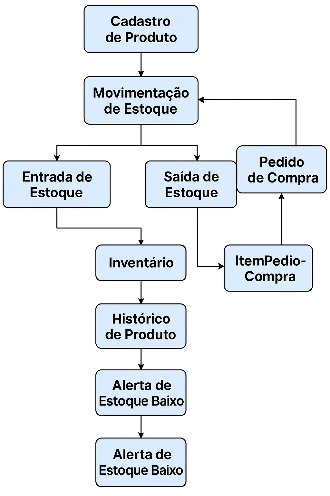
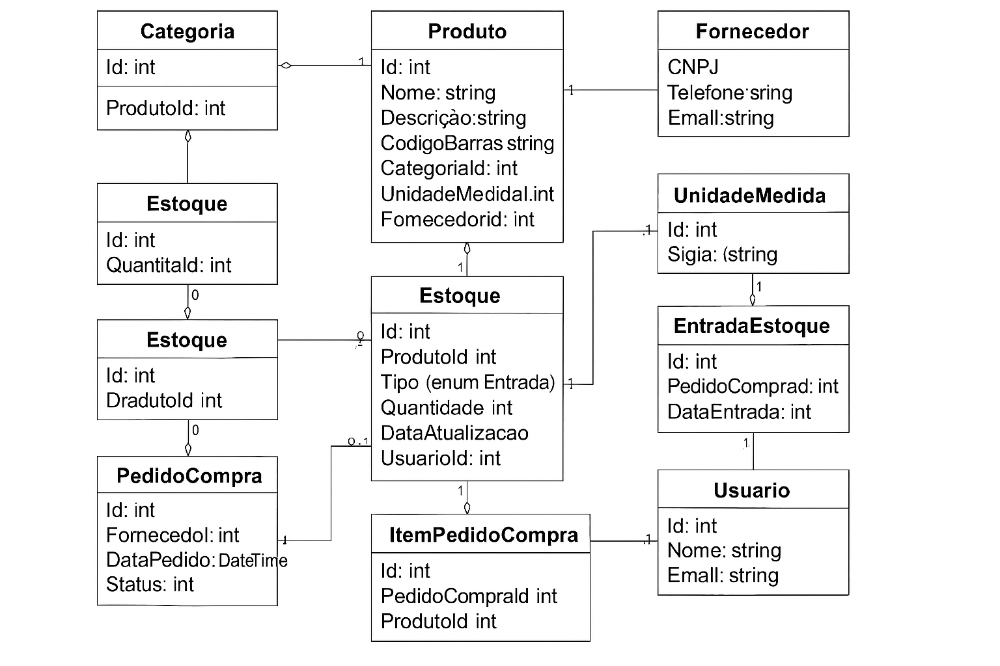

# RDTrackr: Sistema de Gerenciamento de Estoque para Empresa de Usinagem

## 📘 Resumo

O **RDTrackr** é um sistema web de gerenciamento de estoque projetado para empresas do setor de usinagem. Oferece controle detalhado sobre entradas, saídas e movimentações de materiais, ferramentas e produtos acabados, utilizando uma arquitetura de microsserviços com .NET, RabbitMQ, Redis, Docker e SQL Server. A interface será desenvolvida com Blazor ou React.

---

## 📌 Introdução

### Contexto
Empresas de usinagem enfrentam desafios no controle de estoques, impactando diretamente produção e prazos. Um sistema confiável é essencial para eficiência e rastreabilidade.

### Justificativa
Sem controle automatizado, ocorrem desperdícios e atrasos. Um sistema voltado ao setor melhora diretamente a gestão.

### Objetivos
- Desenvolver um sistema web de gerenciamento de estoque;
- Rastrear materiais, ferramentas e peças;
- Controlar movimentações e gerar relatórios;
- Usar arquitetura escalável com microsserviços.

---

## 📚 Fundamentação Teórica

- **Microsserviços:** estrutura modular com APIs independentes;
- **RabbitMQ:** mensageria assíncrona entre serviços;
- **Redis:** cache de dados;
- **Blazor ou React:** para o frontend;
- **Docker:** containerização do ambiente.

---

## 🧩 Descrição do Projeto

### Tema
Sistema de gerenciamento de estoque para usinagem.

### Problemas Identificados
- Falta de controle de estoque;
- Dificuldade em rastrear movimentações;
- Ausência de histórico de uso;
- Reposição lenta de itens críticos.

### Limitações
- Sem módulo financeiro/faturamento;
- Produção em tempo real fora do escopo inicial;
- Integração com ERPs externos fora do escopo.

---

## ✅ Especificação Técnica

### Requisitos Funcionais
- RF01 – Cadastro de itens no estoque;
- RF02 – Entradas com origem e quantidade;
- RF03 – Saídas com destino e responsável;
- RF04 – Saldo atualizado por item;
- RF05 – Histórico de movimentações;
- RF06 – Controle de usuários com níveis de acesso;
- RF07 – Relatórios por período, tipo, setor e responsável;
- RF08 – Notificações de itens críticos;
- RF09 – Itens vinculados a setores ou ordens de produção;
- RF10 – Interface web responsiva.

### Requisitos Não Funcionais
- RNF01 – Disponibilidade de 99,5%;
- RNF02 – Resposta crítica < 500ms;
- RNF03 – HTTPS em todas as requisições;
- RNF04 – Autenticação JWT;
- RNF05 – Microsserviços independentes;
- RNF06 – Suporte à concorrência no banco;
- RNF07 – Compatibilidade com navegadores modernos;
- RNF08 – Logging e monitoramento centralizado.

---

## 🎨 Considerações de Design e Stack Tecnológica

### Arquitetura:
Microsserviços + RabbitMQ + Redis + SQL Server

### Stack:
- **Backend:** .NET Core
- **Mensageria:** RabbitMQ
- **Cache:** Redis
- **Banco:** SQL Server
- **Containers:** Docker
- **Monitoramento:** Grafana
- **CI/CD:** Azure DevOps
- **Frontend:** Blazor ou React

---

## 📊 Modelagem UML

### Fluxo de Movimentação de Estoque

### Diagrama de Classes – RDTrackr

---

## 🚀 Metodologia

Scrum com sprints quinzenais:

1. Levantamento de requisitos;
2. Modelagem da arquitetura e banco;
3. Implementação incremental;
4. Testes unitários e integração;
5. Validação com feedback.

---

## 🧪 Plano de Testes

- **Unitários:** lógica dos microsserviços;
- **Integração:** comunicação entre serviços;
- **Interface:** usabilidade;
- **Performance:** carga e latência.

Ferramentas: xUnit, Postman, SonarCloud.

---

## 📅 Cronograma de Desenvolvimento

| Atividade                                  | Início     | Término    |
|--------------------------------------------|------------|------------|
| Levantamento de requisitos                 | A definir  | A definir  |
| Modelagem de arquitetura e banco           | A definir  | A definir  |
| Implementação dos microsserviços base      | A definir  | A definir  |
| Integração com frontend Blazor/React       | A definir  | A definir  |
| Testes e documentação                      | A definir  | A definir  |

---

## ✅ Considerações Finais

O RDTrackr busca solucionar problemas reais de controle de estoque em empresas de usinagem, aplicando boas práticas de engenharia de software com uma abordagem moderna e escalável.

---

## 🔗 Referências

- [.NET Documentation](https://learn.microsoft.com/dotnet/)
- [Docker Documentation](https://docs.docker.com/)
- [Redis Documentation](https://redis.io/docs/)
- [RabbitMQ Documentation](https://www.rabbitmq.com/documentation.html)

---

## ✅ Status

📌 Projeto em fase de planejamento e documentação técnica. Implementação prevista para próxima etapa.

---

## 👤 Autor

**João Antonio David**  
Engenharia de Software – Católica de Santa Catarina  
Orientador: DIOGO VINÍCIUS WINCK

