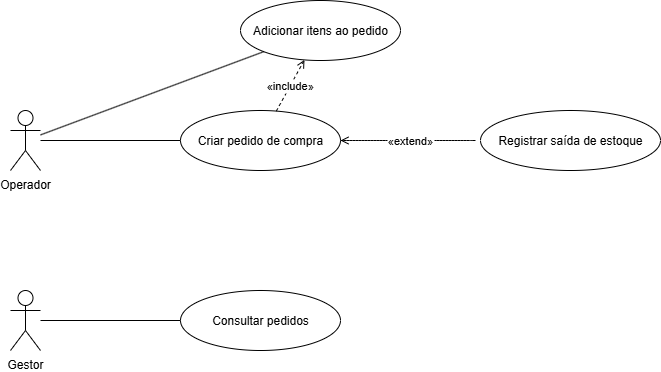
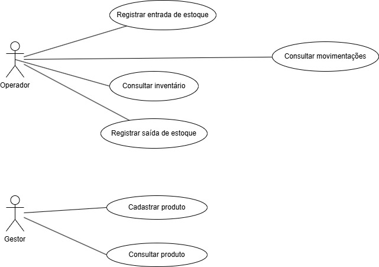
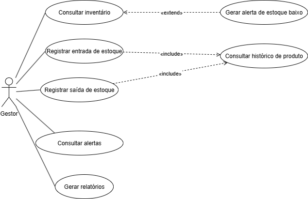
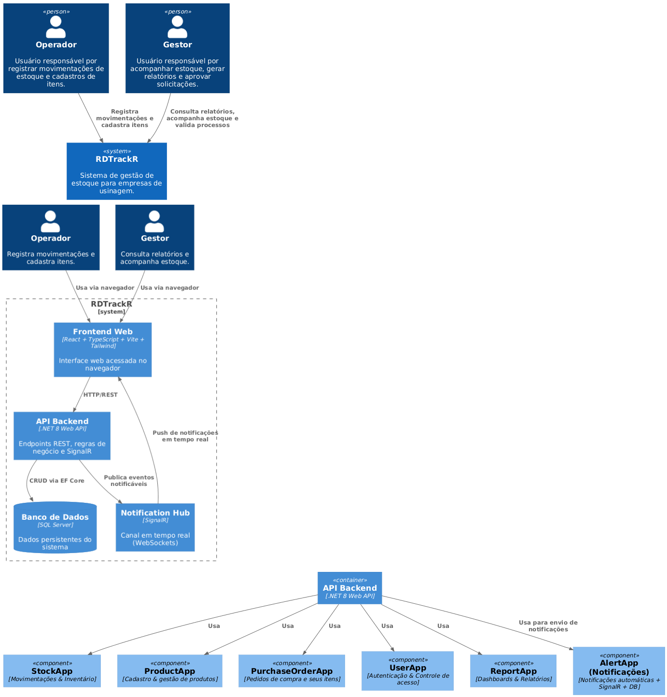

# RDTrackr: Sistema de Gerenciamento de Estoque para Empresas de Usinagem

---

## Resumo

O **RDTrackr** é um sistema web de gerenciamento de estoque desenvolvido para **empresas de usinagem**, oferecendo **rastreabilidade completa**, **alertas automáticos** e **atualização em tempo real**.  
Sua arquitetura é baseada em **.NET 8 Web API** com **Entity Framework Core** e **SQL Server**, e o frontend utiliza **React + TypeScript + Vite + Tailwind**.  
A comunicação em tempo real é garantida pelo **SignalR**, permitindo notificações instantâneas de movimentações e alertas de estoque.  
A solução prioriza **automação, segurança e confiabilidade**, reduzindo perdas e aumentando a eficiência produtiva.

---

## Introdução

### Contexto  
Empresas de usinagem enfrentam desafios complexos no controle de insumos e ferramentas.  
A ausência de controle em tempo real e a dependência de planilhas comprometem a produtividade.  
O RDTrackr foi criado para resolver esses problemas com uma solução moderna, escalável e automatizada.

### Justificativa  
Falhas na rastreabilidade e gestão de estoque geram **custos, atrasos e desperdícios**.  
Baseado em Rezende (2008), o RDTrackr promove **monitoramento contínuo**, **alertas preventivos** e **integração total entre setores**, otimizando o processo produtivo.

### Objetivos  
- Desenvolver um **sistema modular e responsivo** para controle de estoque;  
- Implementar **notificações em tempo real** com SignalR;  
- Gerar **relatórios e dashboards estratégicos**;  
- Garantir **autenticação segura (JWT + RBAC)**;  
- Melhorar a **rastreabilidade e automação operacional**.  

---

##  Especificação Técnica

### Requisitos Funcionais
- **RF01:** Cadastrar e editar itens de estoque;  
- **RF02:** Registrar entradas e saídas;  
- **RF03:** Consultar saldos e movimentações;  
- **RF04:** Emitir alertas automáticos;  
- **RF05:** Manter histórico completo;  
- **RF06:** Gerar relatórios e dashboards.  

### Requisitos Não Funcionais
- **RNF01:** Tempo de resposta inferior a 500ms;  
- **RNF02:** Comunicação em tempo real com **SignalR**;  
- **RNF03:** Autenticação via **JWT** e controle **RBAC**;  
- **RNF04:** Interface responsiva (**React + Tailwind**);  
- **RNF05:** Documentação da API com **Swagger/OpenAPI**;  
- **RNF06:** Suporte a **containerização (Docker/Podman)**.  

---

## Arquitetura e Stack Tecnológica

### Padrões de Design
- **Monólito Modular:** backend organizado em camadas (Domain, Application, Infrastructure);  
- **Clean Architecture:** isolamento de regras de negócio;  
- **Event-Driven:** uso de **SignalR** para notificações assíncronas.

### Stack Utilizada

| Camada | Tecnologias |
|--------|--------------|
| **Backend** | [.NET 8 Web API](https://dotnet.microsoft.com/), [Entity Framework Core](https://learn.microsoft.com/ef/core/) |
| **Frontend** | [React](https://react.dev/), [TypeScript](https://www.typescriptlang.org/), [Vite](https://vitejs.dev/), [Tailwind CSS](https://tailwindcss.com/) |
| **Banco de Dados** | [SQL Server](https://learn.microsoft.com/sql/) |
| **Comunicação** | [SignalR (WebSockets)](https://learn.microsoft.com/aspnet/core/signalr) |
| **Autenticação** | [JWT](https://jwt.io/) |
| **CI/CD** | [GitHub Actions](https://github.com/features/actions) |
| **Qualidade** | [SonarCloud](https://www.sonarsource.com/products/sonarcloud/) |
| **Containerização** | [Docker](https://www.docker.com/) / [Podman](https://podman.io/) |

---

 Diagramas de Caso de Uso (UML)

### Caso de Uso 1: Processo de Compra

### Caso de Uso 2: Movimentação e Cadastro de Produtos

### Caso de Uso 3: Gestão de Estoque e Alertas

## Modelagem C4

O sistema é representado com o modelo **C4**, detalhando os níveis de **Contexto**, **Containers** e **Componentes**, facilitando a compreensão da arquitetura e suas interações.

---

## Considerações de Segurança

- **HTTPS (TLS/SSL)** para tráfego seguro;  
- **JWT ** para autenticação e autorização;  
- **Logs estruturados e auditáveis**;  
- **Validação e sanitização de dados** contra SQL Injection e XSS.

---

## Próximos Passos

- Configurar **CI/CD com GitHub Actions**;  
- Criar ambiente de **homologação e testes automatizados**;  
- Realizar **deploy containerizado** e documentação final.  

---

## Referências

### Frameworks e Bibliotecas
- [.NET 8 Web API](https://dotnet.microsoft.com/)  
- [Entity Framework Core](https://learn.microsoft.com/ef/core/)  
- [React](https://react.dev/)  
- [TypeScript](https://www.typescriptlang.org/)  
- [Vite](https://vitejs.dev/)  
- [Tailwind CSS](https://tailwindcss.com/)  
- [SignalR](https://learn.microsoft.com/aspnet/core/signalr)  
- [JWT (JSON Web Token)](https://jwt.io/)

---

### Ferramentas de Desenvolvimento e Gestão
- [GitHub Actions](https://github.com/features/actions)  
- [SonarCloud](https://www.sonarsource.com/products/sonarcloud/)  
- [Docker](https://www.docker.com/) / [Podman](https://podman.io/)  
- [Visual Studio Code](https://code.visualstudio.com/)  
- [Postman](https://www.postman.com/)  
- [SQL Server Management Studio (SSMS)](https://learn.microsoft.com/sql/ssms/)  
- [Git](https://git-scm.com/)  

---

### Documentação e Guias Técnicos
- [.NET Documentation](https://learn.microsoft.com/dotnet/)  
- [Entity Framework Core Docs](https://learn.microsoft.com/ef/core/)  
- [SignalR Documentation](https://learn.microsoft.com/aspnet/core/signalr)  
- [React Learn](https://react.dev/learn)  
- [Tailwind CSS Docs](https://tailwindcss.com/docs)  
- [TypeScript Handbook](https://www.typescriptlang.org/docs/)  
- [Vite Guide](https://vitejs.dev/guide/)  

---

### Trabalhos Acadêmicos
- REZENDE, Juliana Pinheiro. *Gestão de Estoque: um estudo de caso em uma empresa de materiais para construção*. Monografia (Administração de Empresas) — UniCEUB, Brasília, 2008.

---

## Autor

**João Antonio David**  
Curso: Engenharia de Software – Católica de Santa Catarina  
Orientador: Prof. Diogo Vinícius Winck
