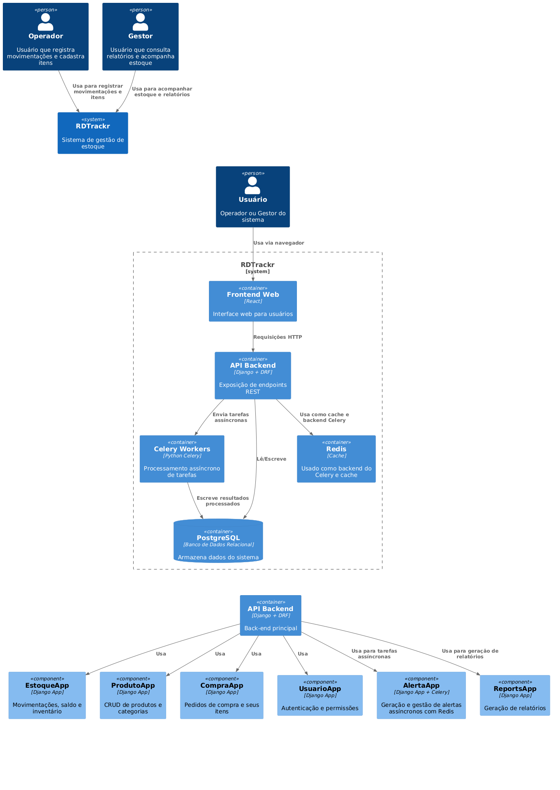

# RDTrackr: Sistema de Gerenciamento de Estoque para Empresas de Usinagem

## Resumo
O **RDTrackr** é um sistema web de gerenciamento de estoque desenvolvido para empresas de usinagem que enfrentam desafios no controle de insumos e ferramentas. O projeto oferece atualização em tempo real, rastreabilidade completa das movimentações e alertas automáticos para itens críticos. Sua arquitetura é baseada em Django, Celery e Redis, promovendo escalabilidade, desempenho e modularidade, com um frontend moderno construído em React.

---

## 1. Introdução

### Contexto
Empresas do setor de usinagem operam com alta complexidade na gestão de materiais. A falta de visibilidade em tempo real sobre movimentações e saldos compromete diretamente a eficiência produtiva. Muitas ainda utilizam planilhas ou sistemas genéricos que não contemplam as particularidades desse setor.

### Justificativa
Para evitar paradas na produção, atrasos em entregas e desperdícios, torna-se essencial contar com um sistema que vá além do simples registro: é necessário monitorar continuamente o estoque, emitindo alertas preventivos. O RDTrackr foi concebido como uma solução sob medida para empresas de usinagem, garantindo controle total, integração e automação.

### Objetivos
#### Objetivo Principal
Desenvolver um sistema web modular para gerenciamento de estoque, focado em atualização em tempo real, rastreabilidade e automação de alertas operacionais.

#### Objetivos Secundários
- Proporcionar uma interface web intuitiva e responsiva;
- Facilitar o acompanhamento em tempo real de saldos e movimentações;
- Gerar alertas automáticos para reposição de itens críticos;
- Permitir emissão de relatórios por setor, período e movimentação;
- Incorporar dashboards interativos para análise estratégica do estoque.

---

## 2. Descrição do Projeto

### Tema
Sistema web de gerenciamento de estoque voltado para empresas de usinagem, com ênfase em rastreabilidade, automação e escalabilidade.

### Problemas a Resolver
- Falta de controle de estoque em tempo real;
- Ausência de alertas automáticos para itens críticos;
- Dificuldade em rastrear movimentações e responsáveis;
- Carência de uma interface especializada para o setor de usinagem.

### Limitações
- Integrações com sistemas externos (ERP, financeiro) não fazem parte do escopo atual;
- O módulo de controle de produção não está incluído no MVP.

---

## 3. Especificação Técnica

### Requisitos Funcionais (RF)
- RF01: Permitir cadastro e edição de itens no estoque;
- RF02: Registrar entradas e saídas, indicando origem e destino;
- RF03: Consultar saldo atualizado por item e setor;
- RF04: Emitir alertas automáticos conforme regras configuráveis;
- RF05: Manter histórico completo de movimentações;
- RF06: Oferecer interface responsiva para diferentes dispositivos;
- RF07: Configurar permissões por tipo de usuário (RBAC);
- RF08: Expor API REST para integrações futuras.

### Requisitos Não Funcionais (RNF)
- RNF01: Garantir tempo de resposta inferior a 500ms nas operações principais;
- RNF02: Utilizar Celery e Redis para processamento assíncrono;
- RNF03: Implementar cache em Redis para dados críticos;
- RNF04: Garantir autenticação via JWT para segurança.

---

## 4. Stack Tecnológica e Considerações de Design

### Considerações de Design
- **Monólito Modularizado:** o backend é construído em Django REST Framework, dividido em módulos de domínio como estoque, movimentações e alertas, facilitando manutenção e testes isolados.
- **MVC:** o Django adota o padrão Model-View-Controller, permitindo clara separação entre dados (Models), regras de negócio e as APIs REST (Views/Serializers).
- **Event-Driven:** o uso do Celery, com Redis como broker e backend de resultados, viabiliza o processamento assíncrono e orientado a eventos para tarefas como geração de relatórios e envio de alertas.

### Tecnologias Utilizadas
| Camada         | Tecnologias                      |
|----------------|---------------------------------|
| Linguagens     | Python, JavaScript              |
| Backend        | Django, Django REST Framework   |
| Frontend       | React, Tailwind CSS             |
| Tarefas        | Celery                          |
| Cache          | Redis                           |
| Banco de Dados | PostgreSQL                      |
| Monitoramento  | Prometheus, Grafana, Loguru     |
| CI/CD          | GitHub Actions, Docker          |

---

## 5. Diagramas de Caso de Uso (UML)

Os diagramas a seguir ilustram as principais interações entre usuários (operadores e gestores) e o sistema.

### Caso de Uso 1: Processo de Compra

### Caso de Uso 2: Movimentação e Cadastro de Produtos

### Caso de Uso 3: Gestão de Estoque e Alertas

---

## 6. Modelagem C4

A modelagem C4 foi adotada para descrever a arquitetura do sistema em diferentes níveis de abstração. O diagrama abaixo apresenta a visão dos principais containers do RDTrackr.

---

## 7. Considerações de Segurança

Para garantir a integridade, confidencialidade e disponibilidade dos dados manipulados pelo RDTrackr, foram adotadas práticas consolidadas de segurança em múltiplas camadas:

- **Comunicação via HTTPS:** Todo tráfego entre cliente e servidor utiliza TLS/SSL, prevenindo ataques do tipo man-in-the-middle.
- **Autenticação JWT + RBAC:** O uso de JSON Web Tokens permite autenticação stateless e escalável, combinada com RBAC para restrição de acessos por papéis.
- **Logs auditáveis e estruturados:** Operações críticas como login, movimentações e relatórios são registradas em logs no formato JSON, facilitando rastreamento e auditorias.
- **Validação e sanitização de dados:** Entradas nas APIs passam por validações rigorosas, prevenindo injeções de SQL e scripts maliciosos (XSS).

---

## 8. Próximos Passos

### Validação da Proposta
Apresentar a documentação técnica, arquitetura e requisitos do RDTrackr ao orientador e banca avaliadora para garantir que a proposta esteja em conformidade com os objetivos acadêmicos e alinhada às necessidades reais do mercado de usinagem.

### Revisões e Refinamentos
Realizar revisões contínuas do documento e da modelagem do sistema com base no feedback recebido, ajustando requisitos, fluxos e diagramas. Aperfeiçoar a clareza e a objetividade das especificações técnicas para consolidar uma base sólida para a fase de desenvolvimento.

### Aprovação Formal
Submeter a documentação final revisada ao orientador e demais professores para obtenção da aprovação formal, validando que todos os critérios acadêmicos do Portfólio I foram devidamente cumpridos.

### Planejamento para Implementação (Portfólio II)
Elaborar o cronograma detalhado para o desenvolvimento do sistema na etapa do Portfólio II, definindo sprints, entregas intermediárias e milestones de acompanhamento. Incluir o planejamento para testes automatizados, integração contínua e homologação em ambiente controlado.

### Preparação do Ambiente Técnico
Configurar o pipeline de CI/CD, os ambientes de desenvolvimento (local e homologação) e garantir a containerização via Docker, visando padronização do deploy e mitigação de problemas de ambiente.

### Engajamento com Stakeholders
Promover reuniões com stakeholders (gestores da empresa de usinagem) para alinhar expectativas quanto a funcionalidades prioritárias, customizações e indicadores de sucesso do sistema.

### Desenvolvimento do MVP
- Implementar funcionalidades principais do MVP;
- Realizar testes automatizados e de integração;
- Implantar ambiente de homologação;
- Obter feedback de usuários reais;
- Ajustar funcionalidades com base no retorno obtido.
---

## 9. Referências

### Frameworks e Bibliotecas
- [Django](https://www.djangoproject.com/)
- [Django REST Framework](https://www.django-rest-framework.org/)
- [React.js](https://reactjs.org/)
- [Tailwind CSS](https://tailwindcss.com/)
- [Celery](https://docs.celeryq.dev/)
- [Redis](https://redis.io/)
- [JWT](https://jwt.io/)

### Ferramentas de Desenvolvimento e Gestão
- [GitHub Actions](https://github.com/features/actions)
- [Docker](https://www.docker.com/)
- [Prometheus](https://prometheus.io/)
- [Grafana](https://grafana.com/)
- [VS Code](https://code.visualstudio.com/)
- [Postman](https://www.postman.com/)

### Documentação
- [Django Docs](https://docs.djangoproject.com/en/stable/)
- [DRF Quickstart](https://www.django-rest-framework.org/tutorial/quickstart/)
- [React Learn](https://react.dev/learn)
- [Tailwind Docs](https://tailwindcss.com/docs)
- [Celery Docs](https://docs.celeryq.dev/en/stable/)

---

## 10. Autor

**João Antonio David**  
Curso: Engenharia de Software – Católica de Santa Catarina  
Orientador: Prof. Diogo Vinícius Winck

---
